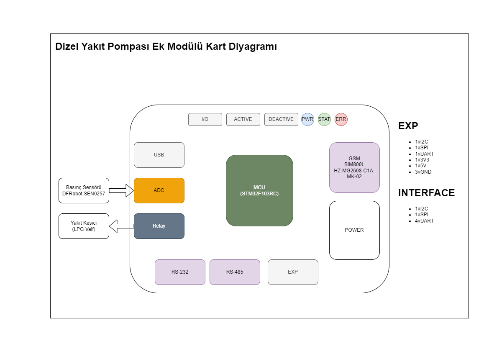
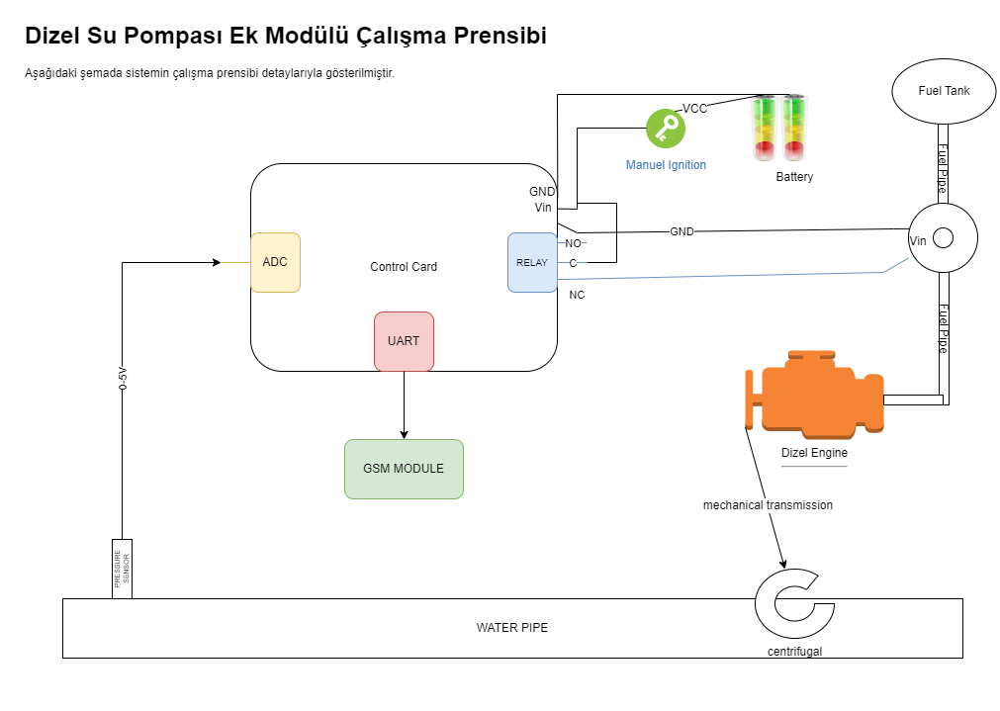

# Proje Başlığı: Dizel Motor Su Pompası Ek Modülü

## 1. Giriş
### 1.1 Proje Tanımı
Müşterimiz, tarım sulama sisteminde kullandığı dizel motor su pompası ile ilgili bir sorun yaşamaktadır. Bu proje, bu sorunu tespit etmek ve çözmek amacıyla yürütülecektir.

### 1.2 Amaç ve Hedefler
Projenin amacı, dizel motor su pompasının çalışmasında aksamaya neden olan problemleri belirlemek ve bu problemleri çözmektir. Hedefler:
- Problemin nedenlerini belirlemek
- Çözüm önerileri sunmak
- Çözümün uygulanabilirliğini test etmek
- Nihai çözümü uygulamak

## 2. Mevcut Durum Analizi
### 2.1 Problemin Tanımı
Müşterimiz, dizel su pompası çalışmakta iken su çekilen kanalda suyun kesilmesi sonucunda santifüj'ün susuz kalarak boşta çalıştığını ve yaklaşık 30 saniye sonra yanarak kullanılamaz hale geldiğini belirtmiştir. Su pompasında barometre olmasına rağmen sistemin otomatik olarak durmasını sağlayan bir araç bulunmamaktadır. Başlatma ve durdurma işlemleri tamamen manuel olarak yapılmaktadır. Müşterimiz su kesintisi durumunda sistemin durmasını ve kendisine SMS bilgilendirmesi gelmesini istemektedir.

### 2.2 Önceki Çalışmalar
Konuyla ilgili daha önce herhangi bir modül tasarımı ve uygulaması yapılmamıştır. Yalnızca geçici çözüm olarak müşterimiz su pompasının başında bekleyerek basınç düştüğünde sistemi durdurmaktadır. Bu çözüm iş gücü gerektirmesi ve efektif olmamasından dolayı müşterimiz için kabul edilmemektedir.

## 3. Çözüm Önerileri
### 3.1 Olası Nedenler ve Çözümler
Sorunun nedenleri:
- Su çekilen kanalda belirsiz saatlerde su kesintileri olması.
- Santrifüj'ün boşta çalıştığında fazla sürtünme yapması ve aşırı ısınmasın.
- Su kesintilerinin önceden bildirimi yapılmayıp tamamen plansız olması.

Çözüm Önerileri:
- Su kesintisi önceden biliniyorsa bu saatler aralığında su pompasının çalıştırılmaması.
- Su basıncının entegre bir sistem ile sürekli kontrol edilerek su kesintisi veya azalması durumunda sistemin otomatik olarak kendini durdurması.

### 3.2 Çözümün Uygulanması
En verimli çözüm belirlenmiştir ve çözümün uygulama adımları aşağıdaki gibidir:
1. Su pompası üzerinde bulunan barometre tamamen analog çalıştığı için ek bir basınç sensörü eklenecektir.
2. Basınç sensörü kanaldan gelen hortum üzerinde olacak ve su boşluğu pompaya varmadan önce durumu sisteme bildirebilecektir.
3. Basınç sensöründen uyarı geldiği anda dizel motor durdurulacak ve su çekme işi son bulacaktır.
4. Dizel motorun durdurulabilmesi için yapılacak bağlantı su pompasının aç-kapa anahtarlamasına bağlanacaktır. Su pompası dijital olarak durdurabilecektir.
5. Sistemin durmasının hemen ardından müşteriye SMS iletilecektir.

## 4. Beklenen Sonuçlar ve Ölçümler
### 4.1 Beklenen Sonuçlar
Çözüm yöntemimiz uygulandığında su kesintileri hangi saat aralığında olursa olsun kesinti olduğu anda su pompası otomatik olarak duracak ve sistemin susuz kalmasından dolayı oluşan tüm problemlerden kaçınılacaktır. Ayrıca müşteriye giden SMS sayesinde müşterimiz sistemin durduğunun haberini alarak sulama programını buna göre ayarlayabilecektir.

### 4.2 Başarı Kriterleri

- Su pompasının hiçbir bileşenlerinin susuz kalma sonuçlarından olumsuz etkilenmemesi.
- Müşterinin sulama durduğuna dair bilgiyi eksiksiz ve zamanında alması.

## 5. Zaman Çizelgesi

1. Problemin Analizi: 1 hafta
2. Çözüm Önerilerinin Geliştirilmesi: 1 hafta
3. Çözümün Uygulanması: 2 hafta
4. Test ve Gözlem: 1 hafta
Toplam: 5 hafta

## 6. Kaynaklar ve Bütçe
Projede kullanılacak malzemeler, hizmet ve işçilik maliyeti gibi değişkenler listelenecek ve toplam hesap çıkartılacak.

Tahmini bütçe: HESAPLANACAK

## 7. Kullanılacak Bileşenler

- 1x ADC
- 1x Röle
- 1x MCU (STM32F103RC)
- 1x GSM Modülü (SIM800L HZ-MG2608-C1A-MK-02)
- Yakıt Kesici (UNOX 24V DC Normalde Açık Solenoid Valf)
- 1x Basınç Sensörü (DFRobot SEN0257)
- 3x LED
- 3x Buton

### MCU İçin Gerekli Pinler
- 1x I2C
- 1x SPI
- 4x UART

### Bileşenlerin Kullanım Sebepleri

Proje diyagramında görüldüğü gibi, sistemin çalışma prensibi istenmeyen durum oluştuğunda motorun durdurularak pompanın kapanmasıdır. Kullandığımız basınç sensörü 0-16 bar aralığında olup düzenli ve sık aralıklarla suyun basıncını ölçecektir. Su kesildiğinde hat içerisinde basınç düşecek ve basıncın düşmesi MCU tarafından algılanacak ve valfe bağlı röle tetiklenecektir. Rölenin tetiklenmesi sonucunda normalde açık olan özelliğe sahip valf kapanacak ve dizel motora yakıt akışı duracaktır. Bu sayede dizel motor stop ederek santifüj'ün yanmasını engelleyecektir. MCU röleyi tetiklerken aynı zamanda GSM modülüyle haberleşme sağlayarak müşterimizin telefonuna bildirim SMS'i gitmesini sağlayacaktır.

## 8. Projenin Genel Çalışma Prensibi

Projenin sözel açıklaması şu şekildedir:

MCu'yu barındıran kart ve diğer tüm ek bileşenler dizel motorun aküsünden beslenecektir. Motora ait olan kontak akü ile modüller arasında bağlantıyı sağlamaktadır. Dizel motorun yakıt tankı ile motor arasında bulunan yakıt hortumuna solenoid valf eklenecektir. Bu valf projenin maliyetini düşürmek amacıyla normalde kapalı olarak belirlenmiştir. Solenoid valfin Vin bağlantısı MCU üzerindeki rölenin NC bacağına bağlıdır. Rölenin Common bacağı ise aküden güç almaktadır. Bu sayede, ek modülün herhangi bir sebeple devre dışı kalması durumunda dahi rölede güç akışı devam edecek ve normalde kapalı özelliğe sahip olan valf açık durumda (Yakıt geçişi mümkün) olacaktır.

Projeye özel olarak tasarlanan ek modül kartı, basınç sensörü ile 0-5v protokolü kullanarak analog haberleşme yapacaktır. 2 saniyelik periyotlar ile basınç sensöründen veriler alınarak ADC ile MCU'ya iletilecektir. MCU tarafından basınç kontrol edilerek, istenilen değerin altına düşmesi durumunda röle tetiklenecek ve dizel motor stop ettirilecektir. Bununla eş zamanlı olarak UART ile GSM modülü haberleşmesi sağlanacak ve belirlenen telefon numarasına durumla ilgili SMS gönderilecektir.

Manuel olarak kontak kapatıldığı durumda aküden gelen güç kesildiği için tüm sistem devre dışı kalacaktır. Ayrıca normalde kapalı olan valf herhangi bir tetikleme almadığı için kapalı konuma geçecektir. Bu sayede dizel motor kapalı durumdayken ekstra güvenlik sağlanmış olacaktır.
## 9. Sonuç ve Öneriler
Bu projede belirtilen çözüm adımları doğru bir şekilde uygulandığında ve gerçek uygulama testi analizlerdeki gibi gittiğinde müşterinin tüm sorunu ortadan kaldırılacaktır. Bununla birlikte, sistem uzaktan başlatma ve durdurma gibi ileriye dönük gelişmelere açıktır. Tamamen manuel olarak çalışan su pompası bu entegre ile birlikte durdurma işlemi kontrol edilebilir hale gelmiştir. İleriye dönük eklemeler ve güncellemelerle sistem insan gücünü daha az harcayacak duruma getirilebilir.

Müşteriye eklenen sensörlere ve kartlara zarar vermemesi, afaki koşullarda bulundurmaması için gerekli uyarılar yapılmalıdır. Projede kullanılan akü, kablo gibi zaman içerisinde yıpranan ve ömrünü tüketen materyaller hakkında düzenli bakım yaptırması belirtilmelidir.

Projede kullanılacak kartın diyagrami aşağıdadır:

Projenin çalışma prensibini açıklayan diyagram aşağıdadır:

